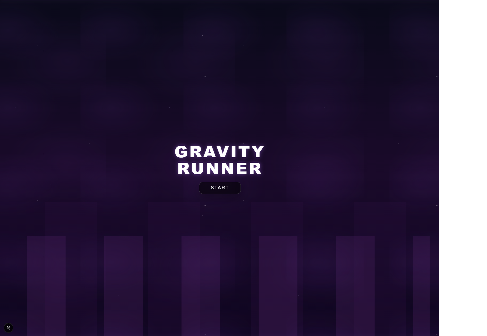
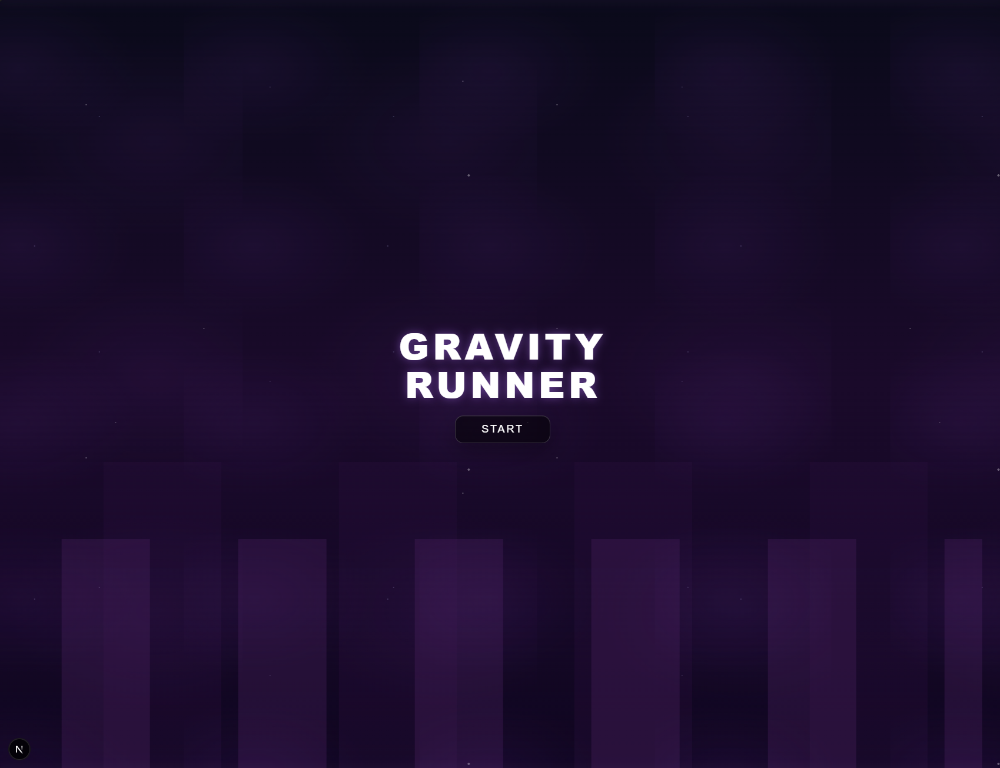

# 🎮 Gravity Runner

  

**Gravity Runner** is a browser-based arcade endless runner where the player controls a character moving between the ceiling and the floor by manipulating gravity.

> **💡 Note:** This project was created as part of a **frontend portfolio**, focusing heavily on application architecture, clean "vanilla" logic within React, "game feel", and UI aesthetics.

---

## 📸 Demo / Preview

### Menu Główne


### Rozgrywka


---

## 🕹️ Game Mechanics

The gameplay is based on simple yet reflex-demanding rules:

* 🏃 **Auto-run:** The character moves automatically to the right (the world scrolls to the left).
* 🧲 **Gravity:** The player does not jump in the classic sense — instead, they **invert the gravity vector**.
* 💀 **Collisions:** Contact with any obstacle ends the game immediately.
* 🪙 **Score:** Collecting coins increases the score counter.

### Controls

| Key | Action |
| :---: | :--- |
| **`SPACE`** | Switches gravity (up ↔ down). Can also be used mid-air. |

---

## ✨ Key Features

* 🎯 **Custom Physics:** Physics engine based 100% on `requestAnimationFrame`, built from scratch.
* 🌌 **Reactive Background:** Animated background that reacts to the game speed.
* 💥 **Game Feel:** Implemented *micro-shake* and *screen flash* on collision for better feedback.
* 💜 **Design:** Neon, minimalist graphic style.
* 🧩 **Modularity:** Component-based UI architecture.
* ⌨️ **Accessibility:** Full keyboard support.

---

## 🛠️ Tech Stack

The project was built using a modern frontend stack:

* 
*  **(App Router)**
* 
* 

🛑 **No external game engines** (like Phaser or PixiJS) were used. The entire game loop, logic, and rendering were written manually to demonstrate programming skills.

---

## 🧱 Architecture

The business logic is completely separated from the presentation layer (UI).

```bash
src/
├── app/                  # Routing (Next.js App Router)
├── components/
│   └── Game/             # Game UI (Player, HUD, Obstacles, Overlays)
├── hooks/
│   └── useGame.ts        # 🧠 The Brain (Central Logic)
├── styles/               # Global and modular styles
```

### `useGame.ts`
This is the central custom hook that manages the entire application state:
* State Machine (MENU / RUNNING / PAUSED / GAME_OVER).
* Handling the **Game Loop**.
* Calculating physics and player position.
* **Collision Detection** (AABB).
* Generating obstacles and coins.

---

## ▶️ Getting Started

To run the project locally:

1.  **Clone the repository:**
    ```bash
    git clone [https://github.com/your-username/gravity-runner.git](https://github.com/your-username/gravity-runner.git)
    cd gravity-runner
    ```

2.  **Install dependencies:**
    ```bash
    npm install
    # or
    yarn install
    ```

3.  **Run the development server:**
    ```bash
    npm run dev
    ```

4.  **Open in browser:**
    👉 `http://localhost:3000`

---

## 📌 Status & Roadmap

The project is actively being developed. Planned features include:

- [ ] 🪙 Coin collection animations (particle effects).
- [ ] 🔊 Sound effects (jump, collision, background music).
- [ ] 🎬 Smooth transitions between states (MENU → GAME).
- [ ] ⚖️ Difficulty balancing (progressive speed increase).

---

## 👤 Author

Project created by **Maksymilian Sokalski**.
